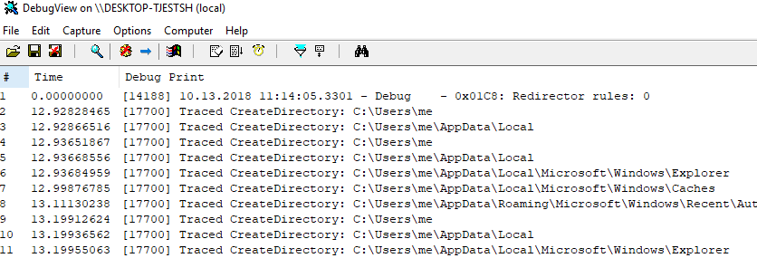

# TakeDetour

This project is a template for building tracers on Windows. It wraps the excellent [Microsoft Detours library](https://github.com/Microsoft/Detours) to create a self-contained, single binary with all the hooking functions you define. As an example, I hooked the `CreateDirectory` function so running the [TakeDetour.exe](https://github.com/lowleveldesign/takedetour/releases) with any application prints all the calls to this function on the Windows Debug Output (you may use [DebugView](https://docs.microsoft.com/en-us/sysinternals/downloads/debugview) to see it). For example:

```
PS> .\TakeDetour.exe -w c:\windows\system32\notepad.exe
INFO: Starting the 'c:\windows\system32\notepad.exe' process.

Press Ctrl + C to stop the target process.
```

Start the DebugView and make sure **Capture -> Capture Global Win32** is checked. Then, open the **New File** dialog in notepad, and you should see trace messages appearing in the DebugView window:



**The released executable works on all Windows system starting from 7 and can hook both 32-bit and 64-bit applications.**

## What this project contains

I implemented two ways of interacting with a target process. You may either **start a new process** or **attach to an existing process**. The first way uses the [`DetourCreateProcessWithDllEx`](https://github.com/Microsoft/Detours/wiki/DetourCreateProcessWithDllEx) function from the Detours library. The latter injects the DLL using the remote thread. 

Whether you start a new process or attach to an existing one, you may add the **-w** argument to control the injection process. This option makes the application to wait for a **Ctrl + C** event or a target process termination. When a user presses Ctrl + C after attaching to a process, the injected DLL is detached, and the target process continues running. Pressing Ctrl + C after starting a new process forces the target process to terminate.

All the dependencies are embedded as binary resources, and TakeDetour unpacks them to a temporary folder (`%TEMP%\takedetour`) on start. The default executable is 32-bit. Thus, to hook a 64-bit process it needs to spawn a helper process. When running TakeDetour on a 64-bit system, remember that the Wow64 engine maps some folder paths. For example: `TakeDetour c:\Windows\System32\notepad.exe` will start a 32-bit notepad.exe. To start the 64-bit version, use `TakeDetour c:\Windows\sysnative\notepad.exe`.

The injected dll name is InjectDll32.dll for 32-bit process and InjectDll64.dll for 64-bit processes.

## How to add your hooks

Open the TakeDetours.sln file in **Visual Studio 2017** and edit the **InjectDll\dllmain.cpp** file. You may want to check [Detours Wiki](https://github.com/Microsoft/Detours/wiki) first to learn how to hook methods with the Detours API. 

You usually start with the hook definition, for example:

```cpp
static BOOL(WINAPI * TrueCreateDirectory)(
    LPCWSTR               lpPathName,
    LPSECURITY_ATTRIBUTES lpSecurityAttributes
) = CreateDirectory;

BOOL WINAPI TracedCreateDirectory(
    LPCWSTR               lpPathName,
    LPSECURITY_ATTRIBUTES lpSecurityAttributes
)
{
    wostringstream output;
    output << L"Traced CreateDirectory: " << lpPathName;
    OutputDebugString(output.str().c_str());

    return TrueCreateDirectory(lpPathName, lpSecurityAttributes);
}
```

Later, you need to enable your hooks in the DllMain method. Please modify only the `DLL_PROCESS_ATTACH` and `DLL_PROCESS_DETACH` blocks. For example:

```cpp
BOOL APIENTRY DllMain(HMODULE hModule,
    DWORD  ul_reason_for_call,
    LPVOID lpReserved
)
{
    ...
    switch (ul_reason_for_call) {
    case DLL_PROCESS_ATTACH:
        DetourRestoreAfterWith();

        DetourTransactionBegin();
        DetourUpdateThread(GetCurrentThread());
        DetourAttach(&(PVOID&)TrueCreateDirectory, TracedCreateDirectory);
        // TODO: add your hooks here
        error = DetourTransactionCommit();
        if (error != NO_ERROR) {
            wostringstream output;
            output << L"Error detouring: " << error;
            OutputDebugString(output.str().c_str());
        }
        break;
    ...
    case DLL_PROCESS_DETACH:
        DetourTransactionBegin();
        DetourUpdateThread(GetCurrentThread());
        DetourDetach(&(PVOID&)TrueCreateDirectory, TracedCreateDirectory);
        // TODO: add your hooks here
        error = DetourTransactionCommit();
        if (error != NO_ERROR) {
            wostringstream output;
            output << L"Error detouring: " << error;
            OutputDebugString(output.str().c_str());
        }
        break;
    }
    ...
}
```

## Reporting bugs

If you find a bug or have an idea for improvement, please add it to the [Issues](https://github.com/lowleveldesign/takedetour/issues) list. 
